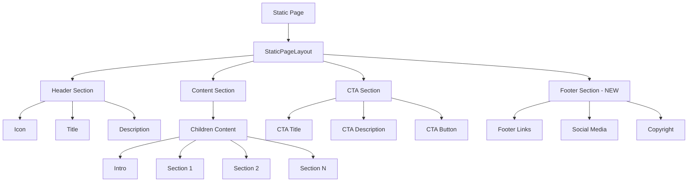
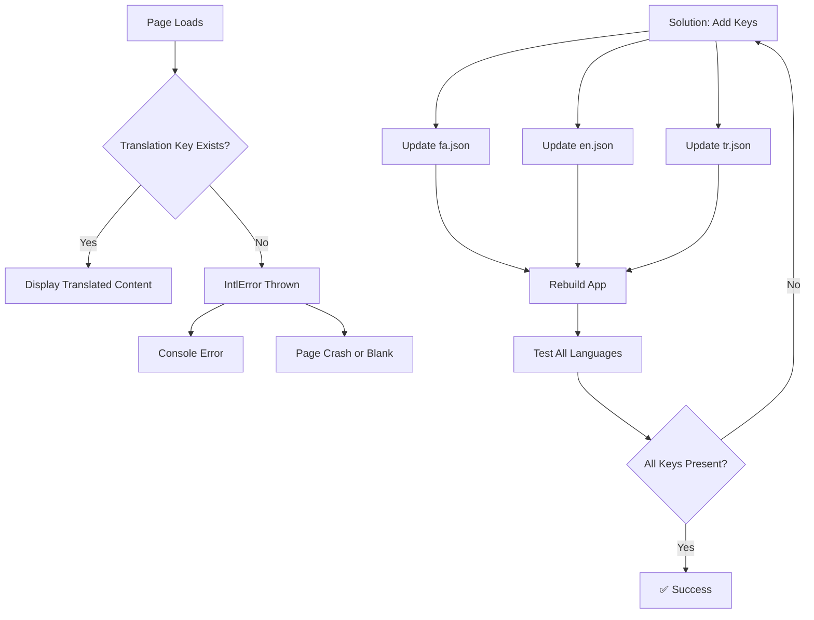

# Design Document

## Overview

این سند طراحی راه‌حل برای رفع مشکلات صفحات Static را ارائه می‌دهد. مشکلات شامل:
1. کلیدهای ترجمه گمشده برای صفحات Privacy و Terms
2. نبود Footer در صفحات Static
3. احتمال وجود مشکلات مشابه در سایر صفحات Static

## Architecture

### Current State Analysis

#### Static Pages Structure
```
frontend/app/[locale]/
├── privacy/page.tsx       ❌ Missing translation keys
├── terms/page.tsx         ❌ Missing translation keys
├── faq/page.tsx           ⚠️  Need to verify
├── about/page.tsx         ⚠️  Need to verify
└── contact/page.tsx       ⚠️  Need to verify
```

#### Translation Files
```
frontend/messages/
├── fa.json    ❌ Missing privacy.* and terms.* keys
├── en.json    ❌ Missing privacy.* and terms.* keys
└── tr.json    ❌ Missing privacy.* and terms.* keys
```

#### StaticPageLayout Component
```typescript
// frontend/components/common/StaticPageLayout.tsx
// ❌ Does not include Footer component
// ✅ Has good structure for header and content
// ✅ Has CTA section support
```

### Required Changes

#### 1. Add Translation Keys

**Files to modify:**
- `frontend/messages/fa.json`
- `frontend/messages/en.json`
- `frontend/messages/tr.json`

**Keys to add:**
```json
{
  "privacy": {
    "title": "...",
    "description": "...",
    "content": {
      "intro": "...",
      "dataCollection": {
        "title": "...",
        "description": "..."
      },
      "dataUsage": {
        "title": "...",
        "description": "..."
      },
      "dataSecurity": {
        "title": "...",
        "description": "..."
      },
      "userRights": {
        "title": "...",
        "description": "..."
      },
      "contact": {
        "title": "...",
        "description": "..."
      }
    },
    "cta": {
      "title": "...",
      "description": "...",
      "button": "..."
    }
  },
  "terms": {
    "title": "...",
    "description": "...",
    "content": {
      "intro": "...",
      "acceptance": {
        "title": "...",
        "description": "..."
      },
      "services": {
        "title": "...",
        "description": "..."
      },
      "bookingPolicy": {
        "title": "...",
        "description": "..."
      },
      "cancellationPolicy": {
        "title": "...",
        "description": "..."
      },
      "liability": {
        "title": "...",
        "description": "..."
      },
      "changes": {
        "title": "...",
        "description": "..."
      }
    },
    "cta": {
      "title": "...",
      "description": "...",
      "button": "..."
    }
  }
}
```

#### 2. Add Footer to StaticPageLayout

**File to modify:**
- `frontend/components/common/StaticPageLayout.tsx`

**Changes:**
```typescript
import Footer from './Footer';

export default function StaticPageLayout({...}) {
  return (
    <div className="min-h-screen bg-gradient-to-br from-blue-50 via-white to-purple-50">
      {/* Header Section */}
      {/* ... existing code ... */}
      
      {/* Content Section */}
      {/* ... existing code ... */}
      
      {/* CTA Section */}
      {/* ... existing code ... */}
      
      {/* Footer Section - NEW */}
      <Footer />
    </div>
  );
}
```

#### 3. Update Privacy and Terms Pages

**Files to modify:**
- `frontend/app/[locale]/privacy/page.tsx`
- `frontend/app/[locale]/terms/page.tsx`

**Changes:**
Add actual content sections using translation keys:

```typescript
export default function PrivacyPage() {
  const t = useTranslations('privacy');

  return (
    <StaticPageLayout
      title={t('title')}
      description={t('description')}
      icon={Shield}
      showCTA={true}
      ctaTitle={t('cta.title')}
      ctaDescription={t('cta.description')}
      ctaButtonText={t('cta.button')}
      ctaButtonLink="/contact"
    >
      {/* Add actual content sections */}
      <div className="prose prose-lg max-w-none">
        <p className="text-gray-600 leading-relaxed mb-8">
          {t('content.intro')}
        </p>
        
        <h2 className="text-2xl font-bold text-gray-900 mb-4">
          {t('content.dataCollection.title')}
        </h2>
        <p className="text-gray-600 leading-relaxed mb-8">
          {t('content.dataCollection.description')}
        </p>
        
        {/* ... more sections ... */}
      </div>
    </StaticPageLayout>
  );
}
```

## Components and Interfaces

### 1. Translation Keys Structure

```typescript
interface PrivacyTranslations {
  title: string;
  description: string;
  content: {
    intro: string;
    dataCollection: {
      title: string;
      description: string;
    };
    dataUsage: {
      title: string;
      description: string;
    };
    dataSecurity: {
      title: string;
      description: string;
    };
    userRights: {
      title: string;
      description: string;
    };
    contact: {
      title: string;
      description: string;
    };
  };
  cta: {
    title: string;
    description: string;
    button: string;
  };
}

interface TermsTranslations {
  title: string;
  description: string;
  content: {
    intro: string;
    acceptance: {
      title: string;
      description: string;
    };
    services: {
      title: string;
      description: string;
    };
    bookingPolicy: {
      title: string;
      description: string;
    };
    cancellationPolicy: {
      title: string;
      description: string;
    };
    liability: {
      title: string;
      description: string;
    };
    changes: {
      title: string;
      description: string;
    };
  };
  cta: {
    title: string;
    description: string;
    button: string;
  };
}
```

### 2. StaticPageLayout with Footer

```typescript
interface StaticPageLayoutProps {
  title: string;
  description: string;
  icon: LucideIcon;
  showCTA?: boolean;
  ctaTitle?: string;
  ctaDescription?: string;
  ctaButtonText?: string;
  ctaButtonLink?: string;
  children?: ReactNode;
  showFooter?: boolean;  // NEW: Optional, defaults to true
}
```

## Data Models

No database changes required. All changes are frontend-only.

## Error Handling

### Translation Key Missing

**Current Behavior:**
```
IntlError: MISSING_MESSAGE: Could not resolve `privacy` in messages for locale `fa`.
```

**Solution:**
Add all required translation keys to prevent this error.

**Fallback Strategy:**
```typescript
// If a translation key is missing, show English as fallback
const t = useTranslations('privacy');
const title = t('title', { fallback: 'Privacy Policy' });
```

### Footer Component Missing

**Current Behavior:**
Static pages don't show footer.

**Solution:**
Import and render Footer component in StaticPageLayout.

## Testing Strategy

### Unit Tests

Not required for this fix as it's primarily content addition.

### Manual Testing Checklist

#### Test 1: Privacy Page
- [ ] Navigate to `/fa/privacy`
- [ ] Verify no console errors
- [ ] Verify page title displays in Persian
- [ ] Verify page content displays in Persian
- [ ] Verify Footer is visible
- [ ] Switch to English (`/en/privacy`)
- [ ] Verify content displays in English
- [ ] Switch to Turkish (`/tr/privacy`)
- [ ] Verify content displays in Turkish

#### Test 2: Terms Page
- [ ] Navigate to `/fa/terms`
- [ ] Verify no console errors
- [ ] Verify page title displays in Persian
- [ ] Verify page content displays in Persian
- [ ] Verify Footer is visible
- [ ] Switch to English (`/en/terms`)
- [ ] Verify content displays in English
- [ ] Switch to Turkish (`/tr/terms`)
- [ ] Verify content displays in Turkish

#### Test 3: Other Static Pages
- [ ] Check FAQ page for translation errors
- [ ] Check About page for translation errors
- [ ] Check Contact page for translation errors
- [ ] Verify Footer on all pages

#### Test 4: Browser Console
- [ ] Open browser console (F12)
- [ ] Navigate to all Static pages
- [ ] Verify no IntlError messages
- [ ] Verify no other errors

## Implementation Notes

### Priority Order

1. **High Priority:**
   - Add translation keys for Privacy and Terms
   - Add Footer to StaticPageLayout
   - Update Privacy and Terms pages with content

2. **Medium Priority:**
   - Verify other Static pages (FAQ, About, Contact)
   - Add missing translation keys if any

3. **Low Priority:**
   - Improve content quality
   - Add more detailed sections

### Content Guidelines

**Privacy Policy Content Should Include:**
- Introduction
- Data Collection (what data we collect)
- Data Usage (how we use the data)
- Data Security (how we protect the data)
- User Rights (GDPR compliance)
- Contact Information

**Terms of Service Content Should Include:**
- Introduction
- Acceptance of Terms
- Services Description
- Booking Policy
- Cancellation Policy
- Liability Limitations
- Changes to Terms

### Translation Quality

- Use professional, clear language
- Be consistent with existing translations
- Follow legal terminology standards
- Ensure accuracy across all three languages

## Design Decisions and Rationales

### Decision 1: Add Footer to StaticPageLayout

**Rationale:**
- Consistency: All pages should have footer
- Navigation: Users need access to footer links
- SEO: Footer contains important links
- User Experience: Expected behavior

**Alternative Considered:**
Add Footer to each page individually - Rejected because it's repetitive and error-prone.

### Decision 2: Use Structured Content Sections

**Rationale:**
- Maintainability: Easy to update specific sections
- Flexibility: Can reorder or add sections easily
- Translation: Translators can work on specific sections
- Consistency: Same structure across languages

**Alternative Considered:**
Single long text block - Rejected because it's hard to maintain and translate.

### Decision 3: Keep StaticPageLayout Generic

**Rationale:**
- Reusability: Can be used for future static pages
- Simplicity: One component for all static pages
- Consistency: Same layout and styling

**Alternative Considered:**
Create separate layouts for each page - Rejected because it creates duplication.

## Deployment Considerations

1. **No Backend Changes:**
   - All changes are frontend-only
   - No database migrations needed
   - No API changes required

2. **Translation Files:**
   - Update all three language files (fa, en, tr)
   - Ensure consistency across languages
   - Test each language separately

3. **Component Changes:**
   - StaticPageLayout is used by multiple pages
   - Test all pages that use it
   - Verify Footer doesn't break layout

4. **Cache Considerations:**
   - Clear browser cache after deployment
   - Verify new translations load correctly
   - Test in incognito mode

## Rollback Plan

If issues occur:

1. **Revert Translation Files:**
   ```bash
   git checkout HEAD~1 frontend/messages/*.json
   ```

2. **Revert StaticPageLayout:**
   ```bash
   git checkout HEAD~1 frontend/components/common/StaticPageLayout.tsx
   ```

3. **Revert Page Files:**
   ```bash
   git checkout HEAD~1 frontend/app/[locale]/privacy/page.tsx
   git checkout HEAD~1 frontend/app/[locale]/terms/page.tsx
   ```

## Diagram: Static Page Structure



## Diagram: Translation Key Resolution


